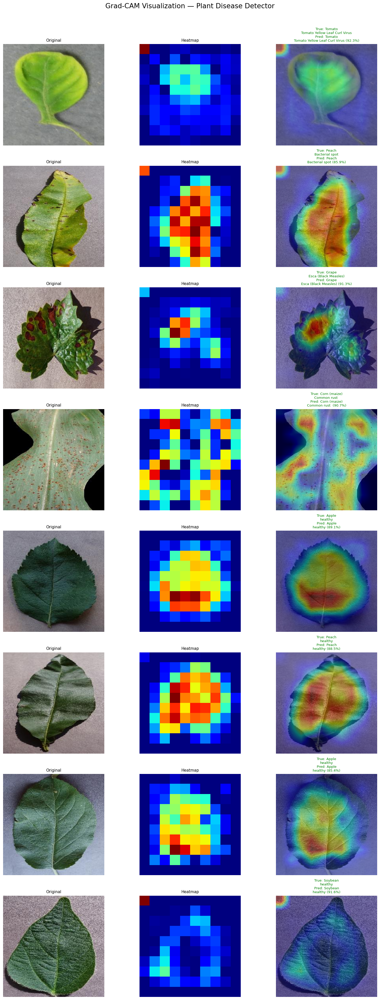
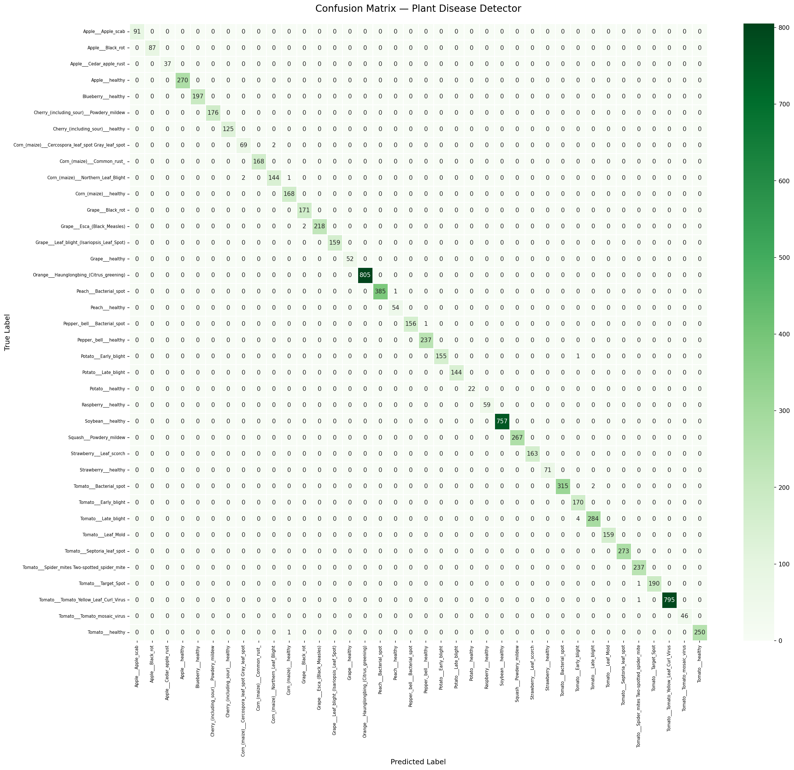

# 🌿 Plant Disease Detector

> An end-to-end ML system that detects plant diseases from leaf images using EfficientNet-B3 with **99.77% accuracy** on 38 disease classes.


---

## 📌 Overview

| Property | Details |
|---|---|
| Dataset | PlantVillage (54,305 images) |
| Model | EfficientNet-B3 (fine-tuned) |
| Classes | 38 plant disease types |
| Test Accuracy | **99.77%** |
| F1-Score (macro) | **0.9969** |
| Inference Time | ~870ms per image (CPU) |

---

## 🖼️ Demo

### Disease Detection + Grad-CAM


### Confusion Matrix


---

## Project Structure
plant-disease-detector/

├── data/               # Dataset (raw + processed)

├── notebooks/          # EDA, training, evaluation

├── src/

│   ├── model/          # EfficientNet-B3 + Grad-CAM

│   ├── api/            # FastAPI backend

│   └── utils/          # Preprocessing + disease info

├── frontend/           # React UI

├── models/             # Saved model weights

└── tests/              # Unit tests
---

## 🚀 Quick Start

### 1. Clone & Install
```bash
git clone https://github.com/marwa698/plant-disease-detector.git
cd plant-disease-detector
python -m venv venv && venv\Scripts\activate
pip install -r requirements.txt
```

### 2. Run API
```bash
uvicorn src.api.main:app --reload
```

### 3. Run Frontend
```bash
cd frontend
npm install
npm run dev
```

### 4. Open Browser
http://localhost:5173/
---

## 📊 Results

| Metric | Score |
|---|---|
| Test Accuracy | **99.77%** |
| F1-Score (macro) | **0.9969** |
| Precision (avg) | **1.00** |
| Recall (avg) | **1.00** |

---

## 🧠 Model Architecture

- **Backbone**: EfficientNet-B3 pretrained on ImageNet
- **Training Strategy**: Two-phase fine-tuning
  - Phase 1: Train classifier head only (5 epochs)
  - Phase 2: Full fine-tuning (15 epochs)
- **Explainability**: Grad-CAM visualization
- **Loss**: CrossEntropyLoss with label smoothing (0.1)
- **Optimizer**: AdamW with CosineAnnealingLR

---

##  Tech Stack

- **Model**: EfficientNet-B3, Transfer Learning, Grad-CAM
- **Backend**: FastAPI, Uvicorn
- **Frontend**: React, Vite
- **Training**: PyTorch, timm
- **Deployment**: Docker, GitHub Actions CI/CD

---

## 👤 Author
**Marwa Yosry** — [GitHub](https://github.com/marwa698)
